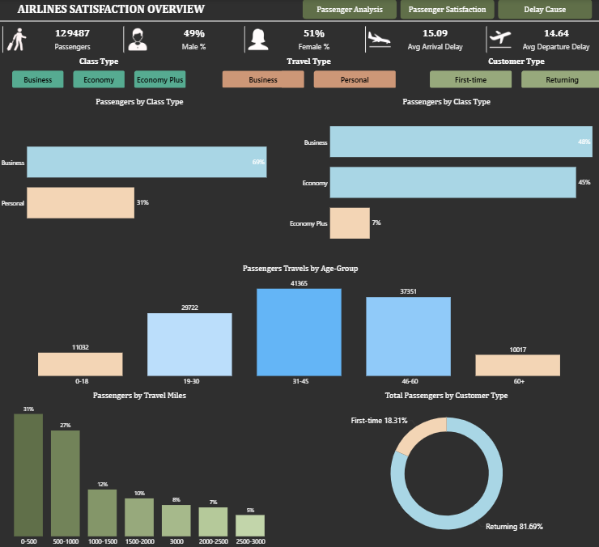
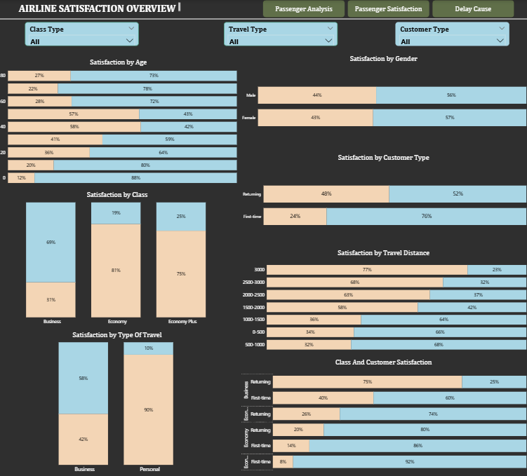
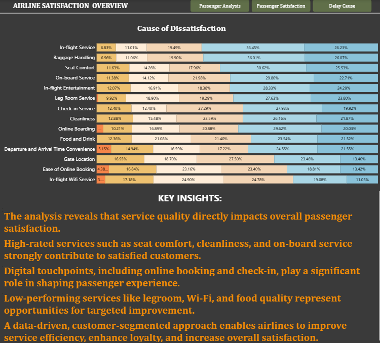

# airline-satisfaction-analysis-dashboard
 # ✈️ Airline Passenger Satisfaction Dashboard (Power BI)

## 📊 Project Overview
This project presents an **interactive Power BI dashboard** designed to analyze airline passenger satisfaction.  
The dashboard helps identify **key drivers of satisfaction and dissatisfaction**, customer behavior patterns, and service improvement opportunities using real-world airline data.

---

## 🎯 Objectives
- Analyze passenger satisfaction across demographics and travel behavior
- Identify service areas impacting customer experience
- Compare satisfaction by class, travel type, and customer loyalty
- Provide data-driven insights for airline service improvement

---

## 🛠 Tools & Technologies
- **Power BI**
- **DAX**
- **Power Query**
- **Data Modeling**
- **Data Visualization**

---

## 📁 Dataset
- Source: Airline Passenger Satisfaction Dataset  
- Records: ~129,000 passengers  
- Features include:
  - Gender, Age, Customer Type
  - Travel Type & Class
  - Service ratings
  - Delay metrics
  - Overall satisfaction

> ⚠️ Note: Dataset used for educational and portfolio purposes.

---

## 📈 Dashboard Pages

### 1️⃣ Passenger Analysis

**Key Insights:**
- Majority of passengers are returning customers
- Business travel dominates higher satisfaction
- Age group 31–45 represents the largest segment

---

### 2️⃣ Passenger Satisfaction

**Key Insights:**
- Business class customers show the highest satisfaction
- Returning customers are significantly more satisfied
- Satisfaction increases with longer travel distances

---

### 3️⃣ Delay & Dissatisfaction Causes

**Key Insights:**
- Seat comfort, cleanliness, and onboard service strongly influence satisfaction
- Digital touchpoints (online booking & check-in) matter significantly
- Legroom, Wi-Fi, and food quality present improvement opportunities

---

## 🔍 Key Business Insights
- Service quality directly impacts overall satisfaction
- Loyal customers are more forgiving and satisfied
- Data-driven segmentation enables targeted service improvements
- Improving low-rated services can significantly boost customer loyalty

---

## 📂 Files Included
- `Airline_Satisfaction_Dashboard.pbix` – Power BI dashboard
- `images/` – Dashboard screenshots
- `data/` – Dataset (if available)

---

## 🚀 How to Use
1. Download the `.pbix` file
2. Open with **Power BI Desktop**
3. Interact with filters and visuals

---

## 👤 Author
**Chetan Sharma**  
📧 Email: Chetansharam230304@gmail.com
💼 LinkedIn: https://linkedin.com/in/chetan-sharma-545b6524a/
📊 Portfolio: https://github.com/Chetansharma99

---

⭐ If you like this project, feel free to star the repository!

## 📊 Dashboard Preview

## 📈 Dashboard Pages

### 1️⃣ Passenger Analysis

**Key Insights:**
- Majority of passengers are returning customers
- Business travel dominates higher satisfaction
- Age group 31–45 represents the largest segment
---
### Passenger Analysis

### Passenger Satisfaction

### Delay Cause Analysis

